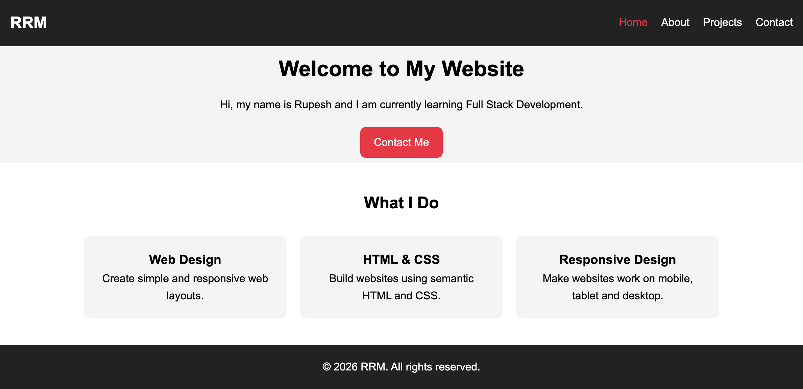
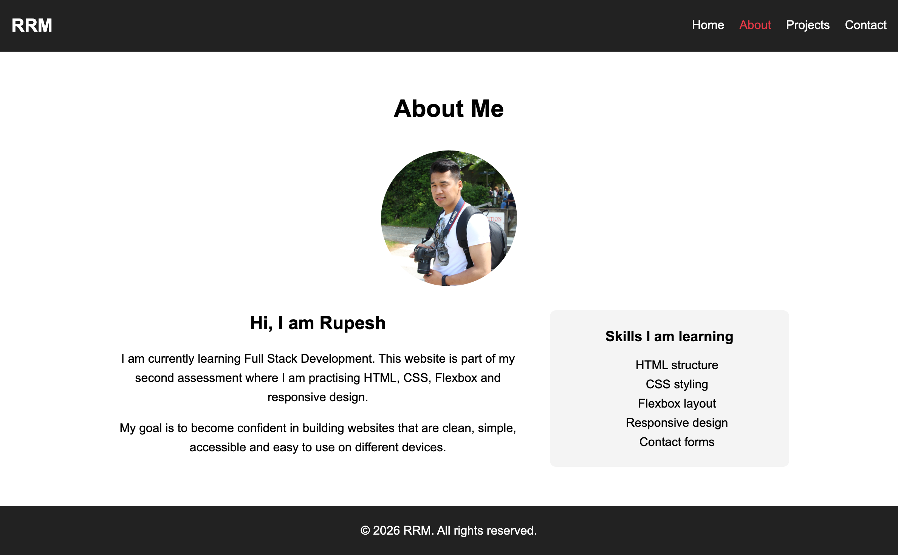
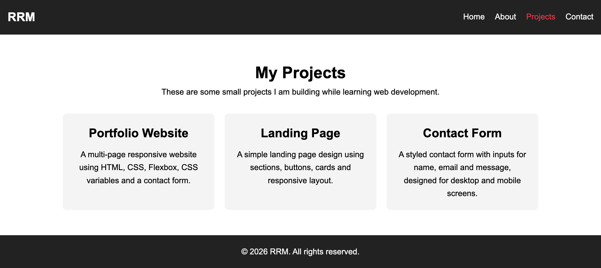
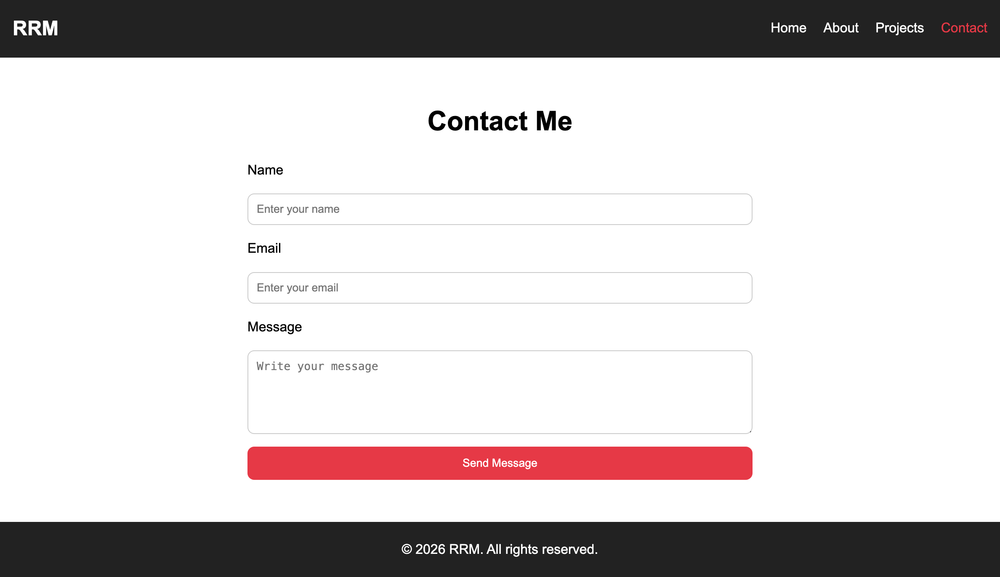

# multiple-page-website-2026

Assignment 2 for the Full Stack Web Development 2026 course, featuring multiple responsive web pages built with modern web technologies.

# Multi-Page Responsive Website 2026

## Description

This project is a responsive multi-page website built using HTML and CSS. The website includes Home, About, Projects, and Contact pages and demonstrates the use of modern CSS techniques such as Flexbox, CSS Variables, pseudo-classes, pseudo-elements, and responsive design.

### Motivation

My motivation for building this project was to strengthen my understanding of HTML and CSS while creating a fully responsive website that works across different screen sizes.

### Why I Built This Project

I built this project as part of my Full Stack Development second assessment to practice creating multi-page websites, working with Flexbox layouts, styling forms, and applying responsive web design principles.

### Problem It Solves

This project demonstrates how a website can be structured across multiple pages while maintaining a consistent design, responsive layout, and user-friendly navigation.

### What I Learned

Through this project, I learned:

- Creating multi-page websites
- Using Flexbox for layout and alignment
- Working with CSS Variables
- Styling forms and navigation menus
- Using pseudo-classes and pseudo-elements
- Responsive web design with media queries
- Organising project files and folders
- Creating reusable CSS styles

---

## Table of Contents

- [Installation](#installation)
- [Usage](#usage)
- [Features](#features)
- [Credits](#credits)
- [License](#license)
- [Badges](#badges)
- [How to Contribute](#how-to-contribute)
- [Tests](#tests)

---

## Installation

To run this project locally:

1. Clone the repository:

```bash
git clone https://github.com/rrana5106/multi-page-responsive-website-2026.git
```

2. Navigate to the project folder:

```bash
cd multi-page-responsive-website-2026
```

3. Open `index.html` in your browser.

---

## Usage

This website can be used as a beginner-friendly multi-page website template for learning responsive web development techniques.

### Live Website

https://rrana5106.github.io/multiple-page-website-2026/

### Screenshot






---

## Features

- Multi-page website structure
- Responsive navigation menu
- Home page hero section
- About page with profile information
- Projects showcase section
- Contact form
- Flexbox layouts
- CSS Variables
- Hover effects
- Pseudo-elements and pseudo-classes
- Responsive design with media queries
- Semantic HTML structure
- Sticky footer layout

---

## Credits

Created by Rupesh Rana

### GitHub Profile

https://github.com/rrana5106

### Resources Used

- MDN Web Docs
- CSS Tricks Flexbox Guide
- GitHub Documentation
- Step8Up Bootcamp Learning Materials

---

## License

N/A

---

## Badges


---

## How to Contribute

Contributions and suggestions are welcome.

1. Fork the repository
2. Create a new branch
3. Make your improvements
4. Submit a pull request

---

## Tests

No automated tests have been added yet.

Manual testing was completed by:

- Checking navigation links between pages
- Testing responsive layouts on different screen sizes
- Verifying hover effects and animations
- Testing contact form inputs
- Checking image and stylesheet paths

---

## Project Structure

```text
multi-page-responsive-website-2026/
│
├── assets/
│   ├── images/
│   │   └── profile.JPG
│   │
│   └── style.css
│
├── pages/
│   ├── about.html
│   ├── projects.html
│   └── contact.html
│
├── index.html
└── README.md
```

---

## Deployment

This project can be deployed using GitHub Pages.

### Deployment Steps

1. Push the project to GitHub
2. Open repository settings
3. Navigate to Pages
4. Select:
   - Branch: `main`
   - Folder: `/root`

5. Save changes

The website will be available at:

https://rrana5106.github.io/multiple-page-website-2026/

